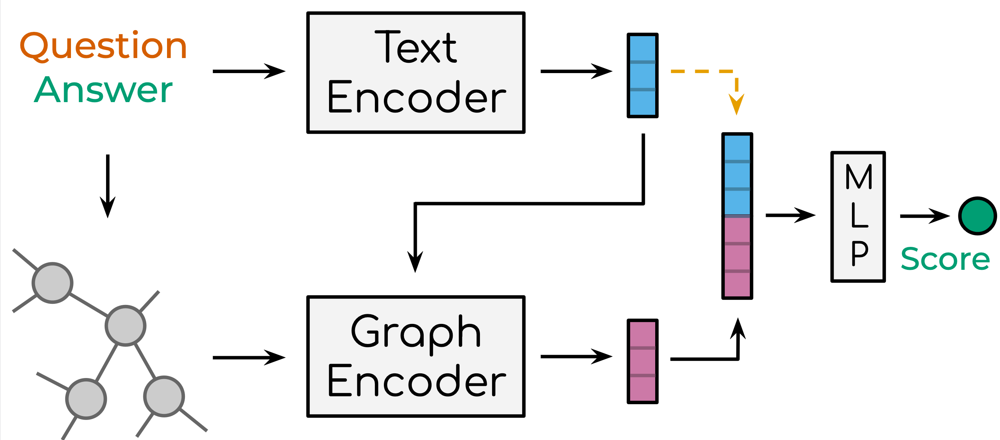

# Faithful Knowledge Graph Explanations in Commonsense Question Answering

This repo accompanies our EMNLP 2022 paper [Faithful Knowledge Graph Explanations in Commonsense Question Answering](https://aclanthology.org/2022.emnlp-main.743/).
Here, we provide the modifications to MHGRN and QA-GNN that we used to produce the results in the paper to increase the faithfulness of the explanations.

<p align="center">
  
</p>

If you use this code in your work, please cite our paper:

```bibtex
@inproceedings{aglionby-teufel-2022-faithful,
    title = "Faithful Knowledge Graph Explanations in Commonsense Question Answering",
    author = "Aglionby, Guy and Teufel, Simone",
    booktitle = "Proceedings of the 2022 Conference on Empirical Methods in Natural Language Processing",
    month = dec,
    year = "2022",
    address = "Abu Dhabi, United Arab Emirates",
    publisher = "Association for Computational Linguistics",
    url = "https://aclanthology.org/2022.emnlp-main.743",
    pages = "10811--10817",
}
```

Thanks to the authors of [MHGRN](https://github.com/INK-USC/MHGRN) and [QA-GNN](https://github.com/michiyasunaga/qagnn), whose code we built on in this repository. 

## Usage

### 0. Dependencies

Run the following commands to create a conda environment (assumes CUDA10; requires gcc 7.x or lower):

```bash
conda create -n krqa-38 python=3.8 numpy matplotlib ipython
conda activate krqa-38
conda install pytorch cudatoolkit=10.1 -c pytorch
pip install spacy==2.1.6 nltk==3.5 tqdm transformers==4.2.2 networkx==2.6.3 jsonlines pandas==1.2.2 datasets==1.3.0 numpy matplotlib tensorboard
python -m spacy download en_core_web_sm
pip install torch-sparse==0.6.1 -f https://pytorch-geometric.com/whl/torch-1.8.0+cu101.html
pip install torch-scatter==2.0.4 -f https://pytorch-geometric.com/whl/torch-1.8.0+cu101.html
pip install torch-geometric==1.6.0 -f https://pytorch-geometric.com/whl/torch-1.8.0+cu101.html
```

Cuda 11.1:
```bash
conda create -n 38-cu111-new python=3.8 numpy matplotlib ipython
conda activate 38-cu111-new
conda install pytorch=1.8.1 cudatoolkit=11.1 pytorch-sparse -c pytorch -c conda-forge -c pyg
pip install spacy==2.3.7 nltk==3.5 tqdm transformers==4.2.2 networkx==2.6.3 jsonlines pandas==1.2.2 datasets==1.3.0 numpy matplotlib tensorboard
python -m spacy download en_core_web_sm
pip install torch-geometric==1.6.0 --no-cache-dir -f https://pytorch-geometric.com/whl/torch-1.8.1+cu111.html
```


### 1. Download data
This step exactly follows [QA-GNN](https://github.com/michiyasunaga/qagnn).
We use the question answering datasets (*CommonsenseQA*, *OpenBookQA*) and the ConceptNet knowledge graph.
Download all the raw data by
```
./download_raw_data.sh
```

The data needs to be pre-processed before using it with the model.
One aspect of this is that QA-GNN requires KG concepts identified by the subgraph finding process (sometimes known as
schema graph construction) to be rated for relevance to the question/answer pair.
This can be done in two ways: using the `--use-lm-scoring` flag with `preprocess.py`, or running pre-processing without
LM scoring and then using the `add_lm_score_to_graph.py` script to post-hoc add the LM scores.

```bash
# Preprocess ConceptNet
python preprocess.py -p <num_processes> --run graph
# Preprocess the two datasets (using both ways of adding LM scoring)
python preprocess.py -p <num_processes> --run csqa --use-lm-scoring
python preprocess.py -p <num_processes> --run obqa
python add_lm_score_to_graph.py data/obqa-cpnet
```
The script will:
* Setup ConceptNet (e.g., extract English relations from ConceptNet, merge the original 42 relation types into 17 types)
* Convert the QA datasets into .jsonl files (e.g., stored in `data/csqa/statement/`)
* Identify all mentioned concepts in the questions and answers
* Extract subgraphs for each q-a pair

**TL;DR (Skip above steps and just get preprocessed data)**. The preprocessing may take long. 
For your convenience, you can download all the processed data (provided by QA-GNN authors) by
```
./download_preprocessed_data.sh
```

### 2. Training & ablations 

The modifications proposed in our paper are activated by passing flag options to the relevant scripts 
(`grn.py` for MHGRN; `qagnn.py` for QA-GNN).
The options are given to the `--ablation` flag separated by spaces. 

| Model  | Flag                           | Description                                                                      |
|--------|--------------------------------|----------------------------------------------------------------------------------|
| MHGRN  | `detach_s_all`                 | Freeze the text encoder                                                          |
| MHGRN  | `no_s_in_final_mlp`            | Don't use the sentence embedding in the final MLP                                |
| QA-GNN | `detach_s_all`                 | Freeze the text encoder                                                          |
| QA-GNN | `no_s_in_final_mlp_direct`     | Don't use the sentence embedding directly from the text encoder in the final MLP |
| QA-GNN | `no_s_in_final_mlp_from_graph` | Don't use the sentence embedding that was used in the GNN in the final MLP       |

In the paper, the *-Embed* experiments correspond to the `no_s_in_final_mlp*` flags.
*-Train TE.* additionally uses the `detach_s_all` flag. 

`scripts/original` contains the scripts to train the models for OpenBookQA. Scripts for CommonsenseQA are easily created by
substituting `csqa` for `obqa`.

### 3. Swapping KGs between questions

In the paper, we swap the KGs between questions to quantify the possible faithfulness of explanations.
Use the `generated_swapped_kgs.sh` script to generate new datasets with swapped KGs.

You can then use the scripts in `scripts/swapped` to train and evaluate the models on the swapped datasets.
